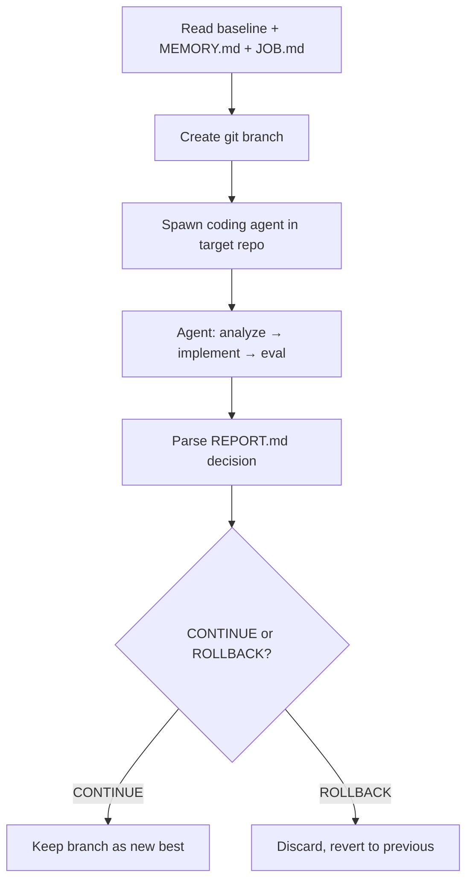

# Autoresearch Technical Deep Dive: Code/ML Research Report

**Date:** April 5, 2026  
**Focus:** Technical internals, iteration loop, hooks for multi-agent integration  
**For:** Paperclip + Hermes + MemOS integration

---

## Executive Summary

Karpathy's autoresearch is a self-improving loop that:
1. An LLM agent edits `train.py` (the only mutable file)
2. Runs a 5-minute training experiment
3. Evaluates `val_bpb` (validation bits per byte)
4. Keeps changes if improved, discards if worse
5. Loops indefinitely (human triggers start, agent runs autonomously)

Several forks/frameworks generalize this pattern for external agent integration.

---

## 1. CORE AUTORESEARCH ARCHITECTURE

### 1.1 File Structure (github.com/karpathy/autoresearch)
```
prepare.py      — FIXED: data prep, evaluation, constants (DO NOT MODIFY)
train.py        — MUTABLE: model, optimizer, training loop (agent modifies)
program.md      — agent instructions (the "skill")
```

### 1.2 Key Constants (prepare.py)
```python
MAX_SEQ_LEN = 2048       # context length
TIME_BUDGET = 300        # training time budget (5 minutes)
EVAL_TOKENS = 8 * 524288 # validation tokens
```

### 1.3 The Iteration Loop (program.md lines 94-112)
```
LOOP FOREVER:
1. Read git state
2. Tune train.py with experimental idea
3. git commit
4. Run: uv run train.py > run.log 2>&1
5. Extract results: grep "^val_bpb:\|^peak_vram_mb:" run.log
6. If crash → read traceback, attempt fix, otherwise log crash
7. Record to results.tsv
8. If val_bpb IMPROVED → keep commit (advance branch)
9. If val_bpb EQUAL/WORSE → git reset to previous state
10. REPEAT FOREVER (never pause to ask human)
```

### 1.4 Output Format (train.py lines 621-630)
```
---
val_bpb:          0.997900    ← PRIMARY METRIC (lower is better)
training_seconds: 300.1
total_seconds:    325.9
peak_vram_mb:     45060.2
mfu_percent:      39.80
total_tokens_M:   499.6
num_steps:        953
num_params_M:     50.3
```

### 1.5 Evaluation Function (prepare.py)
```python
from prepare import evaluate_bpb
# Called at end of training in train.py:
val_bpb = evaluate_bpb(model, tokenizer, DEVICE_BATCH_SIZE)
```

### 1.6 Simplicity Criterion
From program.md: "A 0.001 val_bpb improvement that adds 20 lines of hacky code? Probably not worth it. A 0.001 val_bpb improvement from deleting code? Definitely keep."

---

## 2. EXTENSION POINTS FOR AGENT INTEGRATION

### 2.1 Native Integration Points

**The agent IS the extension point** - autoresearch is designed to be controlled by an LLM agent (Claude Code, Codex, etc.) via:

1. **program.md** - The "skill" file that defines the loop behavior
2. **results.tsv** - Machine-readable experiment log (TSV format)
3. **Git branches** - Each run on `autoresearch/<tag>` branch
4. **stdout parsing** - Agent extracts metrics via grep

**Key insight:** program.md is effectively an agent "skill" that can be customized.

### 2.2 Environment Variables (darwin-derby pattern)
From darwin-derby's runner.py (lines 146-153):
```python
agent_env = {
    **os.environ,
    "DERBY_ITERATION": str(iteration),
    "DERBY_SCORE": str(incumbent["score"]),
    "DERBY_DIRECTION": direction,
    "DERBY_METRIC": score_name,
    "DERBY_PROBLEM": config.name,
}
```

This pattern allows external orchestrators to inject context into agent runs.

---

## 3. KEY FORKS AND EXTENSIONS

### 3.1 darwin-derby (github.com/kousun12/darwin-derby)
**Most generalized framework** - 48 stars

Generalizes autoresearch to optimize ANYTHING with a score function:
- Essay quality, website performance, TSP, packing, prompts
- LLM-as-judge scoring for subjective artifacts
- Blind scoring (agents never see evaluation code)

**Key abstraction:**
```yaml
# problem.yaml
name: my-problem
description: Minimize the cost function.
score:
  direction: minimize
```

**CLI commands:**
```bash
derby init my-problem --direction minimize
derby run -a "claude -p 'read agent_instructions.md and improve'"
derby evaluate  # watches for proposal branches
```

**Integration hooks (runner.py):**
- `run_local()` - single agent loop
- `run_evaluator()` - multi-agent polling evaluator
- Git branch-based proposals (`proposals/<name>/<description>`)
- SQLite history database
- Webhook server for GitHub PR events

### 3.2 autoresearch-at-home (github.com/mutable-state-inc/autoresearch-at-home)
**SETI@home-style distributed swarm** - 462 stars

Adds coordination layer via Ensue shared memory:
```python
from coordinator import Coordinator
coord = Coordinator()
coord.join_hub(invite_token)
coord.claim_experiment("increase LR to 0.04")
coord.publish_result(exp_key, val_bpb, memory_gb, status, description, source)
```

**Shared namespace structure:**
```
@autoresearch-at-home/
├── results/<agent>--<slug>--<hash>   # completed experiments
├── claims/<agent>--<slug>--<hash>    # active work claims (15-min TTL)
├── hypotheses/<agent>--<slug>--<hash> # ideas for experiments
├── insights/<agent>--<slug>--<hash>  # collective learnings
├── best/train_py                     # global best config
├── best/metadata                     # global best stats
└── best/tier/<tier>/                 # per-VRAM-tier bests
```

**Key methods:**
- `coord.claim_experiment(description)` - semantic dedup, race resolution
- `coord.publish_result(...)` - includes full train.py source
- `coord.pull_best_config_for_tier()` - get hardware-appropriate config
- `coord.analyze_swarm()` - who's active, what's been tried
- `coord.ask_swarm("query", namespace="results")` - interrogate collective

### 3.3 auto-agent (github.com/alfonsograziano/auto-agent)
**Autoresearch for AI agents** - optimizes AI agent code

Two-repo architecture:
- Orchestrator (auto-agent) - controls loop, manages branches
- Target agent (any repo) - agent being improved



**Key files:**
- `MEMORY.md` - accumulated learnings across iterations
- `REPORT.md` - per-hypothesis metrics + decision
- `JOB.md` - objective, constraints, codebase overview

### 3.4 agent-digivolve-harness (github.com/MatthewZMD/agent-digivolve-harness)
**Control layer for iterative agent work**

Explicit evaluation packages:
```
evals/
├── checks.yaml      # binary gates
├── judge.md         # evaluator instructions
├── rubric.yaml      # weighted criteria
└── calibration.jsonl # labeled good/bad examples
```

**Usage:**
```bash
digivolve init demo --goal "Improve README" --artifact-type document-copy
# Agent runs: digivolve baseline, digivolve iterate, digivolve keep/discard
```

### 3.5 hf-autoresearch (github.com/mishig25/hf-autoresearch)
**Hugging Face infrastructure version** - 159 stars

Runs entirely on HF Jobs with mounted datasets:
```bash
hf jobs uv run \
    --flavor a100-large \
    -v hf://datasets/karpathy/climbmix-400b-shuffle:/data \
    train.py
```

Adds paper search integration:
```bash
hf papers search "transformer architecture"
```

---

## 4. AWESOME-AUTORESEARCH USE CASES

From github.com/WecoAI/awesome-autoresearch:

| Use Case | Improvement | Method |
|----------|-------------|--------|
| LLM training | 20+ improvements overnight | Original autoresearch |
| Shopify Liquid engine | 53% faster, 61% fewer allocs | 93 automated commits |
| CUDA kernels | 18 → 187 TFLOPS | github.com/RightNow-AI/autokernel |
| Voice agent prompts | 0.728 → 0.969 score | LLM-as-judge evaluation |
| RL post-training | 0.475 → 0.550 eval | Hyperparameter optimization |
| Vesuvius scrolls | 2x cross-scroll generalization | 4-agent 24/7 swarm |

---

## 5. INTEGRATION PATTERNS FOR PAPERCLIP + HERMES + MEMOS

### 5.1 Orchestration Layer Pattern
Paperclip can orchestrate autoresearch loops by:

1. **Spawn worker agents** - Each runs autoresearch with different program.md variants
2. **Shared memory via MemOS** - Similar to autoresearch-at-home's Ensue integration
3. **Claim/publish protocol** - Prevent duplicate work across agents

### 5.2 Hermes Communication Pattern
Hermes can coordinate:
```
┌─────────────────────────────────────────────────────────────┐
│                     HERMES MESSAGE BUS                       │
├─────────────────────────────────────────────────────────────┤
│  claim_experiment   │  publish_result   │  sync_best        │
│  ← Worker Agent A   │  → All Agents     │  ← Coordinator    │
└─────────────────────────────────────────────────────────────┘
```

### 5.3 MemOS State Management
Store autoresearch state in MemOS:
```
/autoresearch/
├── experiments/
│   ├── <agent-id>/<hash>/train.py
│   ├── <agent-id>/<hash>/metrics.json
│   └── <agent-id>/<hash>/status
├── claims/
│   └── <hash> → {agent_id, claimed_at, ttl}
├── best/
│   ├── train.py
│   └── metadata.json
└── hypotheses/
    └── <id> → {description, priority, evidence}
```

### 5.4 Concrete Integration Steps

1. **Wrap train.py execution**
   ```python
   async def run_experiment(agent_id: str, hypothesis: str):
       exp_key = await hermes.publish("autoresearch.claim", hypothesis)
       if not exp_key:
           return  # Someone else has it
       
       # Run the 5-min experiment
       result = await execute_training()
       
       # Publish to MemOS
       await memos.write(f"/autoresearch/experiments/{exp_key}", {
           "train_py": result.source,
           "val_bpb": result.val_bpb,
           "metrics": result.metrics,
       })
       
       # Broadcast to swarm
       await hermes.publish("autoresearch.result", {
           "agent_id": agent_id,
           "exp_key": exp_key,
           **result
       })
   ```

2. **Coordinator agent** (in Paperclip):
   ```python
   class AutoresearchCoordinator:
       async def on_result(self, msg):
           result = msg.payload
           current_best = await self.memos.read("/autoresearch/best/metadata")
           
           if result.val_bpb < current_best.val_bpb:
               await self.memos.write("/autoresearch/best", {
                   "train_py": result.train_py,
                   "val_bpb": result.val_bpb,
                   "improved_by": result.agent_id,
               })
               await self.hermes.publish("autoresearch.new_best", result)
   ```

3. **Worker agent subscription**:
   ```python
   hermes.subscribe("autoresearch.new_best", async (msg) => {
       # Update local baseline
       write_file("train.py", msg.payload.train_py)
       git_commit("adopt global best")
   })
   ```

---

## 6. KEY CODE REFERENCES

### 6.1 Autoresearch Core
- **Main loop logic:** `program.md` lines 94-112
- **Evaluation:** `prepare.py` function `evaluate_bpb()`
- **Training output:** `train.py` lines 621-630
- **Hyperparameters:** `train.py` lines 432-451

### 6.2 Darwin Derby
- **Local runner:** `src/darwinderby/runner.py` function `run_local()`
- **Evaluator:** `src/darwinderby/evaluator.py` function `run_evaluator()`
- **Scoring:** `src/darwinderby/scoring.py` function `run_score()`

### 6.3 Autoresearch-at-home
- **Coordinator:** `coordinator.py` class `Coordinator`
- **Claiming:** `coordinator.py` method `claim_experiment()`
- **Publishing:** `coordinator.py` method `publish_result()`
- **Protocol:** `collab.md` (full THINK/CLAIM/PUBLISH workflow)

### 6.4 Auto-agent
- **Orchestration:** Two-repo architecture with MEMORY.md persistence
- **Decision parsing:** Reads CONTINUE/ROLLBACK from REPORT.md

---

## 7. REPOSITORY URLS

| Repo | URL | Stars |
|------|-----|-------|
| autoresearch (original) | github.com/karpathy/autoresearch | 65.7k |
| darwin-derby | github.com/kousun12/darwin-derby | 48 |
| autoresearch-at-home | github.com/mutable-state-inc/autoresearch-at-home | 462 |
| auto-agent | github.com/alfonsograziano/auto-agent | - |
| agent-digivolve-harness | github.com/MatthewZMD/agent-digivolve-harness | - |
| hf-autoresearch | github.com/mishig25/hf-autoresearch | 159 |
| awesome-autoresearch | github.com/WecoAI/awesome-autoresearch | - |
| autoresearch-macos | github.com/miolini/autoresearch-macos | 1833 |
| autoresearch-win-rtx | github.com/jsegov/autoresearch-win-rtx | 469 |

---

## 8. RECOMMENDATIONS FOR YOUR SYSTEM

1. **Use darwin-derby's problem.yaml pattern** - Generalizes evaluation beyond val_bpb
2. **Adopt autoresearch-at-home's claim/publish protocol** - Prevents duplicate work
3. **Store experiment artifacts in MemOS** - Full train.py source + metrics
4. **Use Hermes for real-time coordination** - claim broadcasts, best updates
5. **Paperclip spawns worker agents** - Each with unique agent_id, shared MemOS
6. **Consider VRAM tiers** - Different optimizations for different hardware classes

The key insight: **The self-improving loop is the pattern, not the specific LLM training task.** Darwin-derby proves this generalizes to any domain with a scoring function.
