# Tower — Agent access architecture (people ↔ Hermes ↔ memory)

This document is the **authoritative reference** for how **real people**, **Discord agent bots**, **Discord channel layout**, and **memory backends (e.g. MemOS)** relate on **Tower** (`sergio`). Update it whenever allowlists, profiles, delegation rules, or specialist-room rollout changes.

**Related:** **`docs/tower-architecture.md`** (teammate on-ramp — all architecture views). `docs/hermes-tower-inventory.md` (ops runbook). **Phased plan / “solid before more agents”:** `docs/tower-architecture-solidification-roadmap.md`. **Discord step-by-step (overrides, `/sethome`, Hermes threading keys, intents):** `docs/tower-discord-channels-permissions.md`. **Hermes runtime on Tower:** §8. **Diagrams:** §4 (levels **L0–L6**, **L7** placement), §3.3, §6.5–§6.7, §9.7. **Conversation placement policy:** §6.6; apply on `sergio`: **`scripts/tower-apply-conversation-policy.sh`**.

---

## 1. Goals

- **Personal agents:** each teammate has a **primary** Hermes profile / Discord bot that only they (by default) control on Discord.
- **Shared specialists:** e.g. **Research** and **HR** bots may be invoked by **specific** people according to policy.
- **CEO (Sergio; Hermes profile `sergio`):** may invoke **HR** (and optionally other specialists) while retaining a **dedicated CEO agent** (`sergio`) for CEO-only work.
- **Memory:** Discord allowlists control **who can talk to which bot**; MemOS `user_id` / `cube_id` per profile controls **whose memory** is read and written. Those layers are **independent**—both must align with intent.
- **Conversation placement:** each bot must treat **where** the human is talking (**surface + thread + profile + user**) as the **active conversation**. **Hermes session** = that placement’s transcript; **MemOS** = optional **shared** store across placements—not a substitute for “what we said **here**.” Policy: **§6.6**.

---

## 2. Actors

### 2.1 People (Discord identities)

| Role | Name (Discord) | Notes |
|------|------------------|--------|
| Operator | Mohammed | Primary Tower operator; Mohamed agent owner. |
| Teammate | Arinze | Arinze agent owner. |
| Teammate | Krati | Krati agent owner (`krati` profile). |
| CEO | Sergio (Hermes profile **`sergio`**) | May delegate to HR / Research per policy below. |

Numeric **Discord user IDs** are stored in Hermes env as `DISCORD_ALLOWED_USERS` (comma-separated where supported). **Do not commit real IDs** into this repo; record policy here and keep IDs on `sergio` in `~/.hermes/profiles/<profile>/.env` only.

### 2.2 Agents (Hermes profiles + Discord bots)

Each row is one **Hermes profile** under `~/.hermes/profiles/<name>/` and typically one **systemd user unit** `hermes-gateway-<suffix>.service` with `ExecStart=... --profile <name> gateway run --replace`.

| Profile (example) | Discord bot (example) | Primary purpose |
|-------------------|------------------------|-----------------|
| `mohammed` | Hermes-Mohamed-Agent | Mohammed’s personal agent. |
| `arinze` | Hermes-Arinze (or equivalent) | Arinze’s personal agent. |
| `krati` | Hermes-Krati-Agent (example) | Krati’s personal agent; **`hermes-gateway-krati.service`** on `sergio`. Setup: **`docs/tower-krati-agent-setup.md`**. |
| `sergio` | CEO agent | CEO-only Hermes profile; **`hermes-gateway-sergio.service`** on `sergio`; not merged with other profiles unless explicitly configured. |
| `research-agent` | Research bot | Research / deep-dive specialist. |
| `hr-agent` | HR bot | HR specialist. |

**Rule:** one **Discord application** = one **bot token** = one **long-running** `gateway run` process. Never run two gateways on the same token.

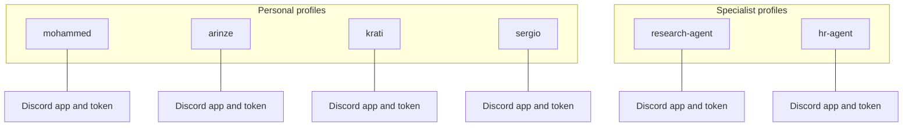

---

## 3. Access policy (who may use which bot on Discord)

### 3.1 Primary access (1:1)

Each **personal** bot should have **`DISCORD_ALLOWED_USERS`** (or approved pairing) limited to **that person** unless you deliberately widen it.

| Person | Primary agent | Discord policy |
|--------|----------------|----------------|
| Mohammed | Mohamed (`mohammed`) | Allow **Mohammed** only (by default). |
| Arinze | Arinze (`arinze`) | Allow **Arinze** only (by default). |
| Krati | Krati (`krati`) | Allow **Krati** only (by default). |
| Sergio (CEO) | CEO agent (`sergio`) | Allow **Sergio** only (by default); use his **numeric Discord user id** in `DISCORD_ALLOWED_USERS`. |

### 3.2 Delegation (who may also invoke shared bots)

Shared bots are configured by **adding** the delegator’s numeric Discord ID to that profile’s `DISCORD_ALLOWED_USERS` (or equivalent pairing flow).

| Person | May invoke (in addition to primary agent) | Rationale |
|--------|-------------------------------------------|-----------|
| Mohammed | **Research** agent | Mohammed may ask research tasks without giving everyone access to Research. |
| Sergio (CEO) | **HR** agent (and optionally **Research**) | CEO may escalate to HR or request research support. |
| Arinze | *(none by default)* | Add HR/Research explicitly if policy changes. |
| Krati | *(none by default)* | Add HR/Research explicitly if policy changes. |

**Alternative (wide open, not recommended for sensitive HR):** `GATEWAY_ALLOW_ALL_USERS=true` in `~/.hermes/.env` allows any Discord user who can see the bot to use it—convenient but weak boundary.

### 3.3 Diagram — two independent gates (human → bot)

Discord **room visibility** and Hermes **allowlist** both apply. A human can pass one and fail the other.

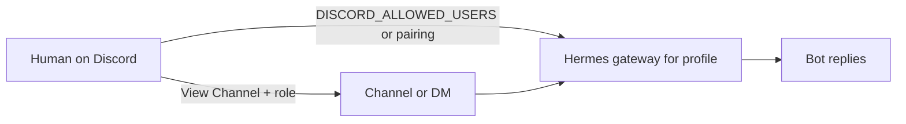

---

## 4. Architecture diagrams (by level)

Read **top-down**: **L0** scope → **L1–L2** who owns which bot → **L3–L4** where and how to talk on Discord → **L5** what context the model gets → **L6** integrated view → **L7** conversation placement key. **Hermes gateway internals:** §8. Tables and ops detail: §3, §5–§6, §9.

### 4.1 Level 0 — Tower stack (one glance)

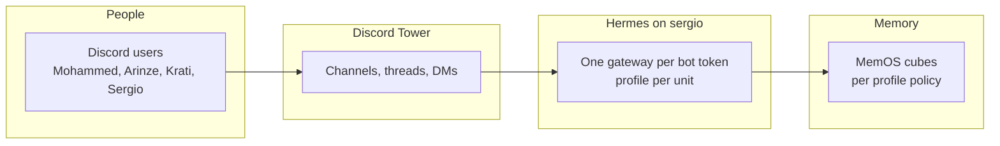

### 4.2 Level 1 — Primary agents (1:1)

Each person’s **default** Hermes profile on Discord. Allowlists should match this unless policy widens.

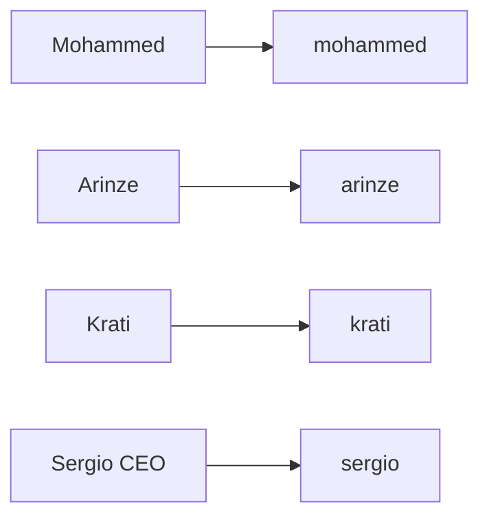

### 4.3 Level 2 — Delegation (shared specialists)

**Policy** adds allowlisted humans on **`research-agent`** / **`hr-agent`**; not automatic routing from personal bots.

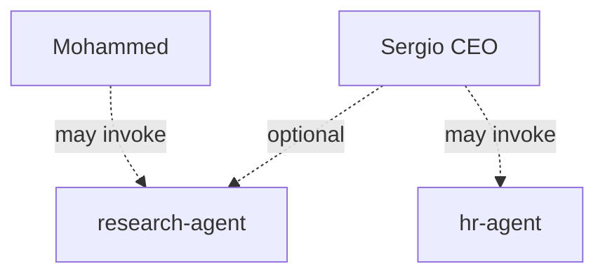

### 4.4 Level 3 — Discord surfaces (where to talk)

**Among Hermes agents:** who should **see** each room vs **Deny View** for clean rooms. Humans still need **View Channel** on their Discord role.

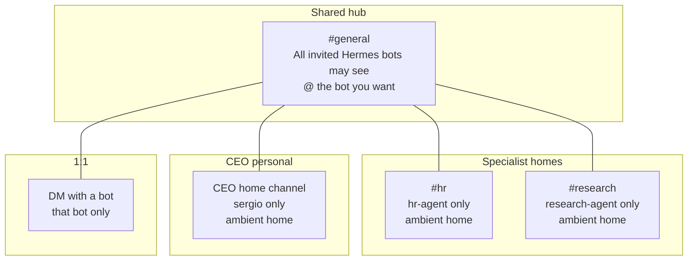

### 4.5 Level 4 — Triggers (how a bot wakes)

**`#general`:** specialists and CEO need **`@`**; bare **`hi`** must **not** wake HR / Research / CEO. **Home channels:** ids in **`free_response_channels`**. **DM:** every message (no **`@`**). **Threads:** new thread often = **new Hermes session** unless you continue the same thread.

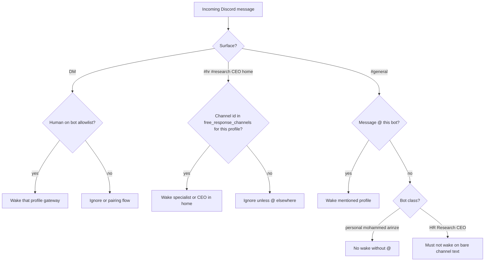

### 4.6 Level 5 — Context at reply time (do not confuse)

What the model may use for **this** reply. **Not** the same as what humans see scrolling Discord.

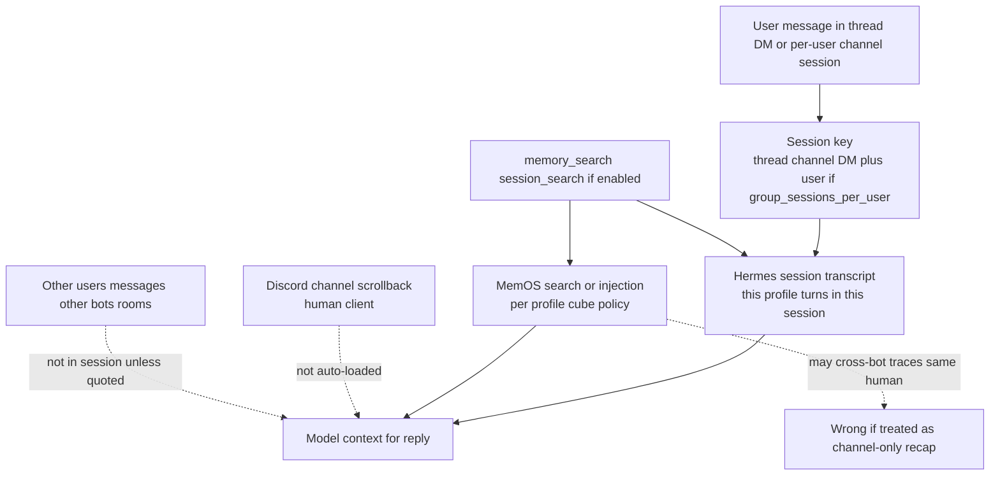

### 4.7 Level 6 — End-to-end (integrated)

People, surfaces, profiles, and context layers in one view. Narrative: §6.

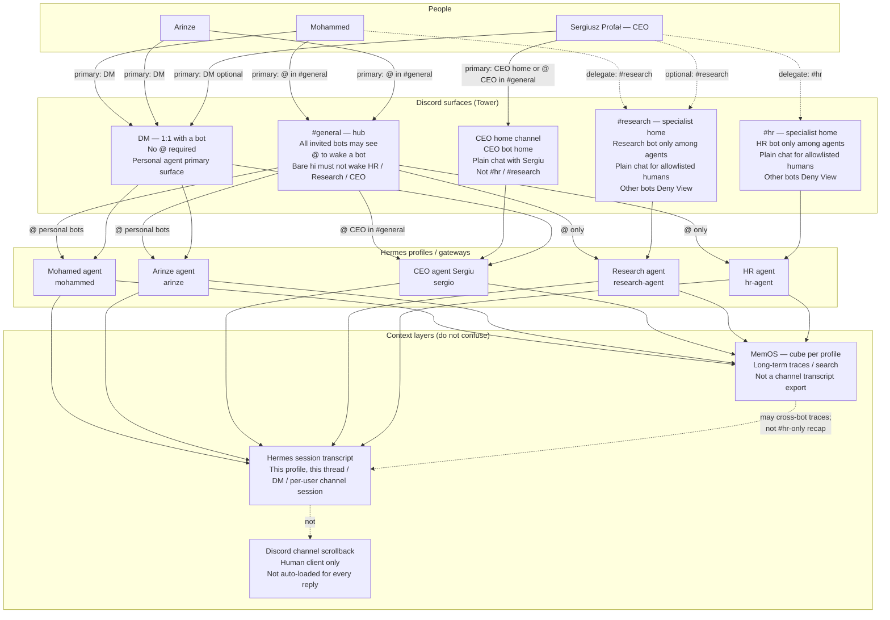

### 4.8 Level 7 — Conversation placement (active vs parallel)

**Placement** = **this profile** + **this Discord surface** (channel / thread / DM) + **this human**. That tuple selects **one active Hermes session** (the **conversation here**). The same human may run **parallel** placements (e.g. Mohamed **DM** vs **`#hr`** with HR); they must **not** be merged in answers unless the user **quotes** or explicitly asks for **stored** cross-placement facts. Full policy: **§6.6**.

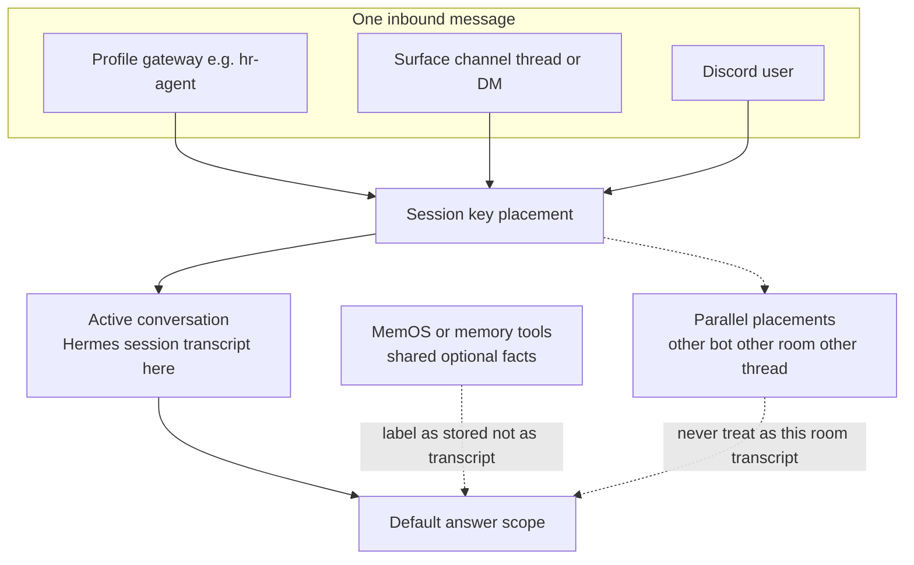

---

## 5. Access matrix (summary)

| Agent profile | Who should talk to this bot on Discord |
|---------------|----------------------------------------|
| `mohammed` | Mohammed (primary). |
| `arinze` | Arinze (primary). |
| `krati` | Krati (primary). |
| `sergio` | Sergio / CEO (primary). |
| `research-agent` | Mohammed + anyone else policy adds (e.g. CEO). |
| `hr-agent` | Sergio + anyone else policy adds (e.g. Arinze for HR intake). |

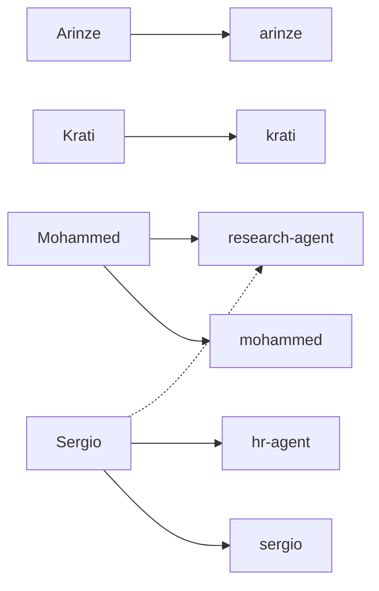

---

## 6. Discord channels (layout ↔ policy)

**Two layers:** (1) **Discord channel permissions** decide which **bot roles can see** which rooms. (2) **`DISCORD_ALLOWED_USERS`** (and pairing) decide which **humans** may invoke each profile. Both must match intent: a human can be allowlisted for HR but still be unable to open **`#hr`** if their Discord role lacks **View Channel** there.

**Operational detail (permissions, `/sethome`, Hermes keys, verification):** **`docs/tower-discord-channels-permissions.md`**. **Session vs MemOS vs “channel history”:** §6.4 and §9.3–§9.4. **Conversation placement (where = which session):** §6.6. **Hermes runtime:** §8.

### 6.1 Channel map (Tower)

| Surface | Typical humans (policy) | Bots that should **see** it (among Hermes agents) | How you use it |
|---------|-------------------------|---------------------------------------------------|----------------|
| **`#general`** (main hub) | Team + all invited bots | **All** invited Hermes bots | Shared room; **@ the bot you want**. Specialists and CEO do **not** answer bare **`hi`** here. |
| **`#hr`** | CEO + ops you add | **`hr-agent`** only | **HR work**; **plain chat** (no `@` HR) for allowlisted humans. Other agent bots **Deny View**. |
| **`#research`** | Mohammed + CEO + others you add | **`research-agent`** only | **Research work**; **plain chat** in home channel for allowlisted humans. Other agent bots **Deny View**. |
| **CEO home channel** | Sergio (CEO) | **CEO (`sergio`)** bot | CEO **personal** agent home; **plain chat** with CEO bot. Not a substitute for **`#hr`** / **`#research`**. |
| **DM with a bot** | Owner on that bot’s allowlist | **That bot only** | **1:1** with **your** personal agent (or a bot that DMs you). **Not** the specialist clean-room pattern. |

### 6.2 Channels and DMs — usage by person and bot

**Personal agents (`mohammed`, `arinze`, `krati`, `sergio`)**

1. **Primary surface:** **`#general`** with **`@Hermes-Mohamed-Agent`** / **`@Arinze`** / **`@CEO-Sergio-Agent`** (exact bot names as invited), **or** a **DM** with that bot if you use DMs.
2. **`#general` (THE SPIRE):** Mohamed is tuned so **`@`** replies stay **in the parent channel** ( **`discord.no_thread_channels`** for that **`#general`** id on `sergio` ) so **your** turns can **stack in one per-user Hermes session** instead of a **new thread per @**.
3. **Do not** use **`#hr`** or **`#research`** for personal-agent work; those rooms are **specialist** bots only (Discord **Deny View** for other bots).

**Specialist agents (`hr-agent`, `research-agent`)**

1. Use **`#hr`** or **`#research`** as the **home** room: **`/sethome`** or **`DISCORD_HOME_CHANNEL`** + **`discord.free_response_channels`** = that channel id on `sergio`.
2. **`#general`:** only when **`@`** the **HR** or **Research** bot ( **`require_mention: true`** ); bare channel messages do **not** wake them.
3. **MemOS** may still hold **cross-bot** traces for the **same human**; that is **not** the same as “what HR said in **`#hr`**” (§6.4, §8.6, §9.3).

**Delegation (policy, not automatic in every channel)**

| If you need… | Use… | Not… |
|--------------|------|------|
| Mohammed’s own work | **`@Hermes-Mohamed-Agent`** in **`#general`** or **DM** | HR / Research rooms for “personal” tasks |
| Research tasks | **`#research`** (Research bot) | Mohamed bot as Research |
| HR tasks | **`#hr`** (HR bot) | Mohamed / CEO bot as HR |
| CEO-only work | **CEO home** or **`@CEO-Sergio-Agent`** in **`#general`** | HR / Research as CEO substitute |

### 6.3 Triggers: `@`, ambient home channels, threads

| Bot class | **`#general`** | **Home channel (`#hr`, `#research`, CEO home)** | **DM** |
|-----------|----------------|-----------------------------------------------|--------|
| **Personal** (`mohammed`, `arinze`, `krati`) | **`@`** required (**no auto-thread** in THE SPIRE **`#general`**) | N/A unless you later add a private personal channel | **Every message** to the bot (no `@`) |
| **Specialists + CEO** | **`@`** required | **Plain messages** OK (channel id in **`free_response_channels`**) | Per bot policy / allowlist (CEO personal bot may also use Telegram on `sergio`) |
| **All in `#general`** | Bare **`hi`** must **not** wake HR / Research / CEO | — | — |

**Threads:** Hermes **session** is keyed by **thread / channel / DM** and (by default) **per user** in shared channels (`group_sessions_per_user: true`). A **new thread** after an **`@`** in **`#general`** is often a **new session** unless you **continue in the same thread**.

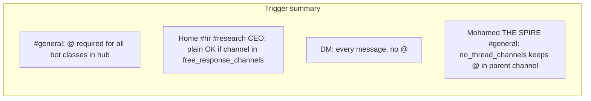

### 6.4 What the bot “sees” (do not confuse these)

| Source | What it is | What it is **not** |
|--------|------------|---------------------|
| **Hermes session transcript** | **This profile’s** user/assistant turns in **this** thread, **DM**, or **per-user channel session** | Full public **`#general`** scrollback; **other people’s** messages; **another bot’s** room |
| **MemOS / memory tools** | Long-term **stored** facts and traces (per **profile cube** policy) | A guaranteed, channel-accurate “last N Discord lines” export |
| **Discord channel history** | What **humans** see in the client | **Not** automatically loaded into the model for every reply |

**Observed failure mode:** user asks “**last replies in `#hr` only**” or “**assistant messages in this session**”; the bot still lists lines from **MemOS** or **another bot** (e.g. Mohamed **DM** / memory-system explainer). **Correct behavior:** answer from **this Hermes session** only, or say **no prior assistant turns in this `#hr` session**; use **quote/reply** if the user needs an older Discord line. **Placement policy:** §6.6. Mitigations on `sergio`: **`SOUL.md`** blocks, **`memory.user_profile_enabled: false`** on specialists, **`scripts/tower-apply-conversation-policy.sh`**.

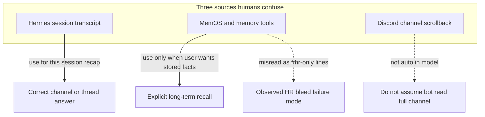

### 6.5 Diagram — routing by intent (which room, which bot)

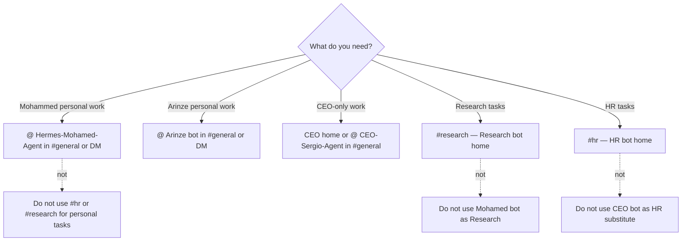

### 6.6 Conversation placement and identity (Tower policy)

**Problem Tower is solving:** the same human may talk to **many bots** in **many rooms** (personal **`#general`** / **DM**, **`#hr`**, **`#research`**, CEO home). Hermes stores **one session transcript per placement** (profile + surface + thread + user). **MemOS** may still hold **shared** traces for that human across bots. Bots must **know where they are** and **which conversation is active**—and must **not** treat shared memory or another bot’s dialogue as **this channel’s** transcript.

**Definitions**

| Term | Meaning on Tower |
|------|------------------|
| **Placement** | **This Hermes profile** handling **this inbound message**, on **this Discord surface** (channel id, optional thread id, or DM) for **this Discord user**. |
| **Active conversation** | The **Hermes session transcript** for **this placement** only—user/assistant turns accumulated since this session started in **this** thread, **DM**, or **per-user channel session**. |
| **Parallel conversations** | Other placements for the **same human** at the same time (e.g. Mohamed **DM** + **`#hr`** with HR + **`@`** Mohamed in **`#general`**). Each has its **own** session; they are **not** interchangeable. |
| **Shared store (optional)** | **MemOS** / memory tools: long-term facts and traces per **profile cube** policy. May include **the same human’s** activity on **other** Tower bots. **Not** a guaranteed export of Discord lines in **this** room. |
| **Channel scrollback** | What humans see in the Discord client. **Not** automatically loaded into the model for every reply. |

**Rules for every bot (model behavior)**

1. **Default scope:** answer from the **active conversation** (this profile’s session for **this placement**). When useful, state **where** you are (e.g. “in **`#hr`** with HR”, “in **DM** with Mohamed agent”, “in **`#general`** thread”).
2. **Recap / history asks** (“what did **you** say **here**”, “list **your** assistant messages **in this session**”, “**#hr** only”, “do **not** use memory_search / session_search”): use **only** assistant (and if asked, user) turns from the **active conversation**. If there are **none**, say so plainly. **Do not** call **`memory_search`**, **`session_search`**, or **`memory_timeline`** for that recap unless the user **explicitly** asks for **stored** memory.
3. **MemOS / injected memory blocks:** if present, treat them as **shared store**, **not** as “messages in this channel.” **Never** list another bot’s lines (Mohamed personal, CEO, Research) as **your** replies in **`#hr`** / **`#research`** / home unless the user **quoted** them **in this session**.
4. **Cross-placement facts:** if the user wants information from **another** room or bot, they must **quote/reply**, **continue in that thread**, use **`/resume`**, or **explicitly** ask for **MemOS** / stored facts—then label the source (**stored memory**, **other session**), not “what we said in **`#hr`** just now.”
5. **Personal vs specialist:** personal agents (**`mohammed`**, **`arinze`**, **`krati`**, **`sergio`**) own **personal** placements; **`hr-agent`** / **`research-agent`** own **specialist** placements. Do **not** substitute one for the other (see §6.2, §6.5).

**Placement map (same human, separate sessions)**

| Placement (example) | Profile | Active conversation is… | Must not be confused with… |
|---------------------|---------|-------------------------|----------------------------|
| **`#general`** `@` Mohamed (THE SPIRE, no auto-thread) | `mohammed` | Per-user session in that **`#general`** | **`#hr`**, Research, CEO sessions; Mohamed **DM** |
| **DM** with Mohamed bot | `mohammed` | That **DM** session | **`#general`**, **`#hr`**, other bots |
| **`#hr`** ambient | `hr-agent` | **`#hr`** session for that user | Mohamed **DM** / MemOS blocks; CEO or Research rooms |
| **`#research`** ambient | `research-agent` | **`#research`** session | Personal agents; **`#hr`** |
| **CEO home** ambient | `sergio` | CEO home session | **`#hr`** / **`#research`** |
| **`#general`** `@` HR / Research / CEO | respective profile | Session for **that @** (often **new thread** unless continued) | Specialist **home** ambient session **unless** same thread continued |

**Regression prompt (after policy apply on `sergio`):** in **`#hr`**, ask: *List only **your** assistant messages in **this** `#hr` session so far; do **not** use memory_search or session_search.* **Pass:** only HR assistant turns from **this** placement, or “no prior assistant turns.” **Fail:** MemOS architecture text, Mohamed **DM** lines, Meet/skills digressions, or “**memory context** provided” / “memory block” treated as **`#hr`** transcript. **Observed fail:** **2026-05-13 ~14:31** (pre-bundle); **~15:05** **after** **`scripts/tower-apply-conversation-policy.sh`** on **`sergio`** (all five gateways active; SOUL markers + **`user_profile_enabled: false`** on specialists).

**Implementation layers (what enforces policy)**

| Layer | What it does | Tower status |
|-------|----------------|--------------|
| **Discord layout** | Wrong bots **Deny View** on specialist rooms | **Done** (§7.1) |
| **Hermes session key** | `group_sessions_per_user`, thread vs channel, **`no_thread_channels`** (Mohamed **`#general`**) | **Partial** — configured on `sergio`; team must **continue same thread** where threads exist |
| **SOUL / operator prompts** | Placement, MemOS boundary, channel recap blocks | **Scripts** — **`scripts/tower-apply-conversation-policy.sh`** |
| **Specialist MemOS injection** | **`memory.user_profile_enabled: false`** on **`hr-agent`** / **`research-agent`** | **Applied** via recall script; **insufficient alone** for recap |
| **Gateway / MemOS product** | Disable or scope injection on recap; **per-cube** boundaries | **To-do** (§7.3) |

### 6.7 Diagram — placement vs shared store

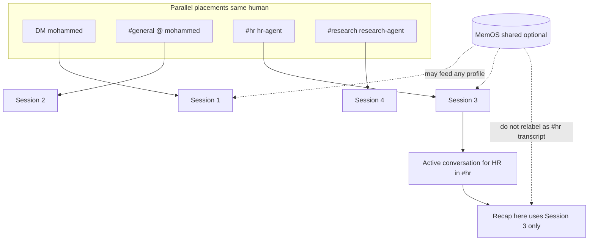

---

## 7. Implementation status (living)

Update this subsection when behavior on Discord or `sergio` changes.

### 7.1 Done

- **Access model** in this document: primary vs delegated use of `mohammed`, `arinze`, `krati`, `sergio`, `research-agent`, `hr-agent` (see §3 and §5).
- **Dedicated `#hr`** with wrong-agent bots **denied View** so HR is the only specialist that can read that room (see `tower-discord-channels-permissions.md` §3.2).
- **`hr-agent`** profile + **`hermes-gateway-hr-agent.service`** on `sergio` (`HERMES_HOME` → `~/.hermes/profiles/hr-agent`).
- **Identified Hermes levers** for specialist-room UX: **`auto_thread`**, **`free_response_channels`**, **`discord.require_mention`**, home (`/sethome` / `DISCORD_HOME_CHANNEL`), **Message Content Intent**, Discord thread perms (journal **50001** if auto-thread stays on).
- **`#hr` Hermes + Discord:** **`DISCORD_HOME_CHANNEL`** and **`discord.free_response_channels`** aligned to the **real `#hr` id** from **`hr-agent/channel_directory.json`** (Tower had briefly pointed HR home at **`#research`** — fixed); **`#hr`** ambient chat **verified working** after correction.
- **`research-agent` Hermes (Chunk 2 — server):** **`discord:`** in **`config.yaml`** — **`require_mention: true`**, **`auto_thread: false`**, **`free_response_channels: '1503722569277374534'`** (home **`#research`**); **`DISCORD_HOME_CHANNEL`** matches in **`.env`**; **`hermes-gateway-research-agent.service`** — **active**.
- **`#research` Discord layout (operator):** channel id **`1503722569277374534`**; **only humans + Research bot** among agents — **Deny View** for other specialist bots, **same goal as `#hr`**.
- **`#general` mention-only for specialists + CEO:** **`hr-agent`**, **`research-agent`**, and **`sergio`** use **`require_mention: true`** with **`free_response_channels`** limited to each profile’s **home** channel id so bare messages in **`#general`** do not wake those bots; **`mohammed`** / **`arinze`** / **`krati`** unchanged (`require_mention: true` + hub **`no_thread_channels`**). See **`tower-discord-channels-permissions.md`** §4.
- **`sergio` (CEO):** **`hermes-gateway-sergio.service`** + CEO-only **`DISCORD_ALLOWED_USERS`**; **`discord.require_mention: true`** and **`free_response_channels`** = CEO **home** channel id (ambient there, @ in **`#general`**). **Sergio** to re-verify in Discord.
- **`krati` (personal):** profile + **`hermes-gateway-krati.service`** provisioned on **`sergio`** (**2026-05-16**); **`scripts/tower-provision-krati-agent.sh`**; Discord bot token + allowlist **operator** — see **`docs/tower-krati-agent-setup.md`**.

### 7.2 Partial / not matching target yet

- **`sergio` + `mohammed` Telegram:** both profiles still define **`TELEGRAM_BOT_TOKEN`** with the **same** token → Hermes logs **token already in use** on **`sergio`** until **`sergio`** gets a **dedicated** BotFather bot **or** Telegram is removed from **`sergio`** (policy: keep Tower Telegram overall; do not strip Telegram from the **host** without operator intent).
- **`hr-agent` Telegram:** **`TELEGRAM_BOT_TOKEN`** removed from **`hr-agent`** **`.env`** — HR is **Discord-first**; avoids competing for the shared token with **`mohammed`**. Restore a **unique** token if HR must use Telegram again.

### 7.3 To-do

- **`#research`:** optional — plain **`hello`** in **`#research`** without `@` to confirm Hermes matches **`#hr`** behavior end-to-end.
- **`krati` gateway live:** **`DISCORD_BOT_TOKEN`** + **`DISCORD_ALLOWED_USERS`** on `sergio`; MemOS **`MEMOS_USER_ID=krati`**, **`MEMOS_CUBE_ID=krati-cube`** (**`scripts/tower-provision-krati-memos.sh`**). Invite bot + Discord verify: **`docs/tower-krati-agent-setup.md`** §4.
- **MemOS:** **`MEMOS_USER_ID` / `MEMOS_CUBE_ID`** are **set** on existing profiles on `sergio` (audit after **`krati`** clone); **human sign-off** still required that **cube ownership** matches delegation policy (keys present ≠ policy verified). Ops script: `scripts/tower-audit-memos-telegram.sh` (run on `sergio` via `bash`).
- Re-check **`DISCORD_ALLOWED_USERS`** for every human who should use **`#hr`** / **`#research`** after rooms stabilize.
- **`sergio` Telegram:** add **second** BotFather token on **`sergio`** **only**, or accept log noise until then.
- (Optional) Add **operator / SOUL** guidance so in-channel answers do not contradict **`config.yaml`** (e.g. “intents only” vs real keys).
- **`hr-agent` conversation placement:** **`scripts/tower-apply-conversation-policy.sh`** run on **`sergio`** (**2026-05-13**); SOUL markers on all five profiles; **`arinze`** gained Discord + MemOS boundary blocks; gateways **active**. **Regression recap in `#hr` still fails** (~**15:05**) — HR cites “**memory context provided**” and foreign-bot / Meet lines as this session while **`memory.memory_enabled: true`** on **`hr-agent`**.
- **Apply / re-apply** placement SOUL + specialist config on `sergio`: **`scripts/tower-apply-conversation-policy.sh`**; re-run **§6.6 regression prompt** after each change. If still failing, optional strict HR: **`scripts/tower-hr-strict-placement-enforce.sh`** (operator — disables MemOS injection on **`hr-agent`**).

---

## 8. Hermes architecture (Tower on `sergio`)

**Hermes** is the **agent runtime** on **`sergio`**: long-lived **gateway** processes connect chat surfaces (Discord first on Tower) to **one profile** each (config, persona, tools, memory). This section is **how Hermes is shaped on Tower**—not generic product docs. **People, rooms, and policy:** §2–§6. **Operator steps:** §9.

### 8.1 Runtime model

| Piece | On Tower |
|-------|----------|
| **Host** | **`sergio`** — install under **`~/.hermes`**; operator user **`openclaw`** |
| **Profile** | Named agent home **`~/.hermes/profiles/<profile>/`** (`mohammed`, `arinze`, `krati`, `sergio`, `research-agent`, `hr-agent`) |
| **Gateway** | One **`gateway run --profile <name>`** per Discord bot token; supervised by **`hermes-gateway-<suffix>.service`** (user **systemd**) |
| **CLI / ad-hoc** | Same binary via **`hermes --profile <name> …`**; avoid a second **`gateway run`** on the same token |
| **Surfaces** | **Discord** (primary for Tower agents); some profiles also define **Telegram** (see §9.5 — no duplicate tokens across concurrent gateways) |

**Invariant:** one **Discord application** → one **bot token** → one **gateway process** → one **profile** (§2.2).

### 8.2 Profile directory (what lives on disk)

| Path (under `~/.hermes/profiles/<profile>/`) | Role |
|-----------------------------------------------|------|
| **`config.yaml`** | Models, **`discord:`** (mention, home, threads), **`memory:`**, toolsets, **`group_sessions_per_user`**, display |
| **`.env`** | Secrets and overrides: **`DISCORD_*`**, **`MEMOS_*`**, **`TELEGRAM_*`**, **`DISCORD_HOME_CHANNEL`**, allowlists |
| **`SOUL.md`** | Persona + Tower policy blocks (Discord context, MemOS boundary, channel recap) |
| **`channel_directory.json`** | Hermes mapping of guild/channel ids (e.g. **`#hr`** home for **`hr-agent`**) |

Do **not** commit secrets from **`.env`** into this repo.

### 8.3 Inbound message → reply (gateway path)

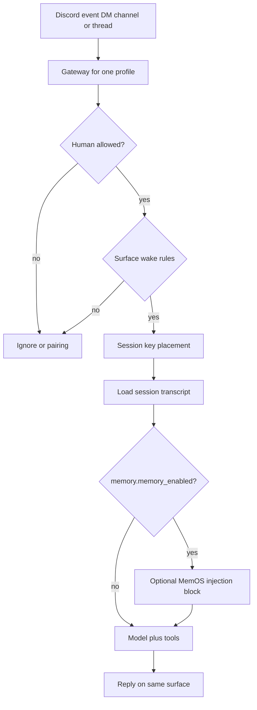

**Tower wake rules** (which messages reach the gateway): §6.3 — **`@`** in **`#general`**, ambient **home** channels in **`free_response_channels`**, **DM** without **`@`**.

### 8.4 Sessions and placement

Hermes persists a **session transcript** per **placement** (§6.6):

| Input to session key | Effect on Tower |
|----------------------|-----------------|
| **Profile** | Transcript is **this bot’s** turns only |
| **Channel / thread / DM** | Different thread or DM → **different** session (unless continued) |
| **`group_sessions_per_user: true`** | In shared channels, **per-user** sessions (not one room-wide log) |
| **`discord.no_thread_channels`** | **`@`** replies stay in **parent** channel (Mohamed THE SPIRE **`#general`**) |
| **`auto_thread` / home** | Specialist **`#hr`** / **`#research`** ambient chat in **home** channel |

Hermes does **not** load full Discord **scrollback** into every reply (§9.4).

### 8.5 Memory inside Hermes (MemOS hook)

| `config.yaml` (`memory:`) | Meaning on Tower |
|---------------------------|------------------|
| **`memory_enabled`** | When **true**, gateway may **inject** MemOS text into the prompt and expose **memory** tools |
| **`user_profile_enabled`** | When **false** on specialists, reduces profile-style MemOS; **does not** alone stop all injection if **`memory_enabled`** stays **true** |
| **`provider`** | **`memtensor`** (MemOS 2.0 plugin) on audited profiles |
| **`MEMOS_USER_ID` / `MEMOS_CUBE_ID`** (`.env`) | **Which human / cube** this profile reads and writes — independent of Discord allowlist (§9.3) |

**Placement policy:** session transcript = **this room**; MemOS = **shared store** — do not treat injection as **`#hr`** transcript (§6.4, §6.6).

### 8.6 Tools and platform toolsets

Hermes exposes **tools** (browser, file, **memory**, **session_search**, skills, etc.) per **platform** in **`platform_toolsets`** (`cli`, `telegram`, `discord`, …). On Tower, **Discord** profiles typically use **`hermes-discord`**; **CLI/Telegram** lists may still include **`memory`** and **`session_search`** even when the user forbids them in chat—**SOUL** and config must align with §6.6.

### 8.7 Diagram — Hermes layers on Tower

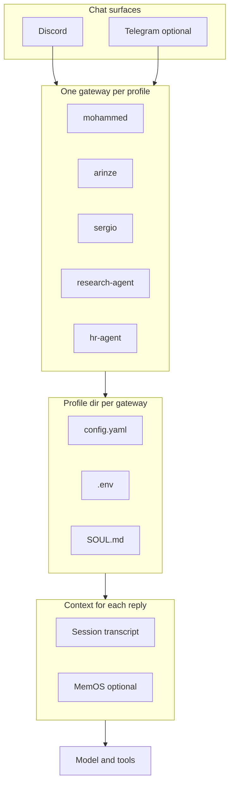

### 8.8 Related Tower levers (quick index)

| Concern | Hermes keys / files | Doc |
|---------|---------------------|-----|
| Who may invoke bot | **`DISCORD_ALLOWED_USERS`**, pairing | §3, §9.1 |
| Which room wakes bot | **`require_mention`**, **`free_response_channels`**, **`DISCORD_HOME_CHANNEL`** | §6.3, `tower-discord-channels-permissions.md` |
| Session continuity | **`no_thread_channels`**, threads, **`group_sessions_per_user`** | §6.3, §9.4 |
| MemOS / recap bleed | **`memory_enabled`**, **`user_profile_enabled`**, **`MEMOS_*`**, SOUL | §6.6, §9.3, §9.8 |
| Process health | **`systemctl --user`**, **`journalctl`** | §9.6, `hermes-tower-inventory.md` |

---

## 9. Implementation on `sergio`

### 9.1 Discord allowlists

- Per profile: `~/.hermes/profiles/<profile>/.env`  
  - `DISCORD_ALLOWED_USERS=id1,id2,...`  
- After edits: `systemctl --user restart hermes-gateway-<unit>.service` for that profile’s gateway.

### 9.2 Pairing vs allowlist

Hermes may use **pairing codes** for first contact. If `hermes --profile X pairing list` is empty but the bot still says “don’t recognize you”, confirm the **running** gateway’s `--profile` matches the profile you use for `pairing approve`.

### 9.3 MemOS / memory

- Each profile’s `.env` (or `config.yaml`) should set **`MEMOS_USER_ID`**, **`MEMOS_CUBE_ID`** (or project equivalents) so memory isolation matches **business** intent—not only Discord visibility.
- Delegation on Discord does **not** automatically grant cross-cube MemOS reads; configure MemOS and Hermes tools explicitly if CEO or Research must read another cube.
- **Cross-agent bleed (observed):** with **`memory_enabled: true`**, MemOS injection can surface **the same human’s** recent turns on **another Tower bot** (e.g. Mohamed personal agent). A specialist may then **mistake** that block for **this bot’s** Discord session and answer “your last messages” with **another bot’s** assistant text. Mitigation: **per-profile `MEMOS_CUBE_ID`**, **SOUL** “MemOS ≠ this session” (see **`scripts/tower-memos-agent-boundary.sh`**), and test “last N messages **you** sent **in #hr**” vs “in MemOS”.
- **Channel recap (observed):** even with “**#hr only**”, HR may still **`memory_search` / `session_search`** and list **Mohamed DM** lines (e.g. memory-system explainer, “How’s it going?”) as if they were **#hr** replies. Mitigation: **`memory.user_profile_enabled: false`** on specialists, **SOUL** “channel recap” ( **`scripts/tower-hr-channel-recall-fix.sh`** ), and answers **only** from **this session** unless the user asks for **stored** HR facts. **Authoritative policy:** §6.6; **bundle apply:** **`scripts/tower-apply-conversation-policy.sh`**.

### 9.4 Discord chat context (session vs channel scrollback)

Hermes does **not** mirror the full public Discord channel into the model. The gateway loads **this profile’s Hermes session transcript** for the current **thread / DM / per-user channel session** (see Hermes Discord guide — session transcript loading). Messages in **other threads**, **parent `#general`** before a thread, or **other users’** traffic are **not** in context unless the user **quotes/replies**, **continues in the same thread**, uses **`/resume`**, or facts were stored via **MemOS** / memory tools.

**Tower mitigations (on `sergio`):** **`SOUL.md`** on profiles includes **Tower Discord context**; **`mohammed`** lists **THE SPIRE `#general`** in **`discord.no_thread_channels`** so **`@`** replies stay in-channel and **accumulate per-user session** instead of spawning a **new thread per @** (each thread = isolated session). **`#hr` / `#research` / CEO home** still use **home-channel** ambient chat per **`free_response_channels`**. Ops script: **`scripts/tower-discord-session-context.sh`**. **Full placement bundle:** **`scripts/tower-apply-conversation-policy.sh`** (§6.6, §9.8).

### 9.8 Conversation placement — apply and verify on `sergio`

**On `sergio` (SSH):** from a copy of this repo (or pipe the script with **LF** line endings):

1. Run **`bash scripts/tower-apply-conversation-policy.sh`** — applies, in order: **`tower-discord-session-context.sh`** (session scope + Mohamed **`no_thread_channels`**), **`tower-memos-agent-boundary.sh`** (MemOS ≠ this session), **`tower-hr-channel-recall-fix.sh`** (specialist recap + **`user_profile_enabled: false`** on **`hr-agent`** / **`research-agent`**). Idempotent markers in **`SOUL.md`**; restarts affected gateways.
2. Confirm units: **`systemctl --user is-active hermes-gateway-hr-agent.service`** (and other units the script restarts).
3. **On Discord** in **`#hr`**, send the **§6.6 regression prompt** as allowlisted user. **Pass:** only HR assistant turns in **this** placement, or explicit “no prior assistant turns.” **Fail:** MemOS / Mohamed / CEO / Research / Meet-skills text, or phrasing like “**memory context provided**”, presented as **`#hr`** history — log time, profile, and gateway unit; continue §7.3 **gateway / MemOS** work or run **`scripts/tower-hr-strict-placement-enforce.sh`** on **`sergio`** if policy accepts HR without MemOS injection.

**Verify:** HR reply cites **this `#hr` session** only (or states none); no “memory block” / other-bot lines as **`#hr`** transcript.

### 9.5 Telegram

Do **not** reuse the same `TELEGRAM_BOT_TOKEN` across two `gateway run` processes. Use a **unique** Telegram bot per profile or omit Telegram for profiles that are Discord-only.

### 9.6 Troubleshooting: gateway exits right after “Hermes Gateway Starting…”

If `systemctl` shows **`status=1/FAILURE`** within a second of the banner, the real error is often **above** the last few lines. On `sergio`:

```bash
journalctl --user -u hermes-gateway-arinze.service --since "10 min ago" --no-pager
```

Look for **`LoginFailure`**, **`401`**, **`Telegram bot token already in use`**, **`SyntaxError`**, or **tracebacks** from Hermes reading `.env`.

**`No user allowlists configured`** means Hermes did **not** load any Discord allowlist for that process: confirm **`DISCORD_ALLOWED_USERS=`** exists in **`~/.hermes/profiles/<profile>/.env`** (correct profile name), no typos, comma-separated numeric IDs only, and that you **restarted** the matching unit after editing. Alternatively use **`GATEWAY_ALLOW_ALL_USERS=true`** in `~/.hermes/.env` only if policy allows open access (not recommended for HR).

### 9.7 Diagram — runtime on `sergio` (profiles ↔ gateways)

One **systemd user unit** per profile; **never** two gateways on the same Discord bot token.

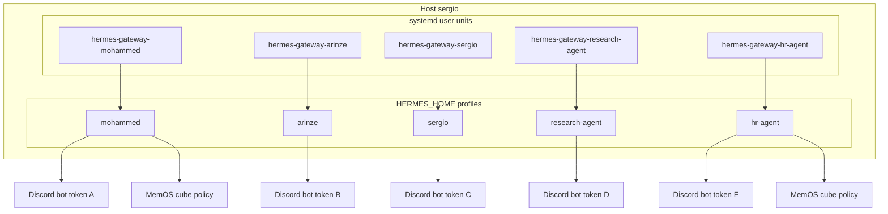

---

## 10. Operational checklist (onboarding / offboarding)

1. **Add person:** add numeric Discord ID to the right profiles’ `DISCORD_ALLOWED_USERS`; restart affected gateways.  
2. **Remove person:** remove ID from all profiles; rotate any shared secrets if they had access to tokens.  
3. **New specialist bot:** new Discord app → `gateway setup` → new `systemd` unit with `--profile <name>` → allowlist + MemOS IDs → restart.  
4. **CEO delegation change:** edit `hr-agent` / `research-agent` allowlists only—no need to widen personal bots unless intended. **CEO** is **Sergio** (`sergio`); use his **numeric Discord id** where policy lists the CEO.  
5. **New specialist channel (e.g. `#hr` / `#research`):** follow **`docs/tower-discord-channels-permissions.md`** (Deny View for non-owner bots, human roles, `/sethome`, Hermes threading keys); then update §7 **implementation status** in this file.

---

## 11. Revision history

| Date | Change |
|------|--------|
| 2026-05-11 | Initial document: people vs agents, primary vs delegation, Discord vs MemOS, diagram, implementation pointers. |
| 2026-05-11 | Link to solidification roadmap (`tower-architecture-solidification-roadmap.md`). |
| 2026-05-12 | Link to `tower-discord-channels-permissions.md` (channel layout + overrides). |
| 2026-05-12 | §6 Discord layout table; §7 **implementation status** (done / partial / to-do); renumber former §6–§8 → §8–§10. |
| 2026-05-12 | CEO naming: **Sergiusz Profał** (“Sergiu”), Hermes profile **`sergio`**. |
| 2026-05-12 | §7.2: **`require_mention`** blocker for plain `#hr` messages (fix on `sergio`). |
| 2026-05-12 | §7.1: operator confirms **`#research`** Discord = **`#hr`** pattern (humans + Research; deny other bots). |
| 2026-05-12 | §7.1 / §7.3: **`#hr`** ambient chat **verified**; §7.3 HR routing item closed. |
| 2026-05-12 | §7.1: **`#hr`** id aligned to **`channel_directory.json`** + operator verified; §7.2/§7.3 MemOS audit + **`hr-agent`** Telegram removed (Discord-first); **`sergio`** / **`mohammed`** shared Telegram noted. |
| 2026-05-13 | §8.4: Discord **session vs channel scrollback**; **`mohammed`** **`no_thread_channels`** for THE SPIRE **`#general`**; **`SOUL.md`** Tower Discord context; **`scripts/tower-discord-session-context.sh`**. |
| 2026-05-13 | §8.3: MemOS **cross-agent** recall vs session; **`scripts/tower-memos-agent-boundary.sh`**. |
| 2026-05-13 | §8.3: **#hr-only recap** vs MemOS/session_search; **`scripts/tower-hr-channel-recall-fix.sh`**. |
| 2026-05-13 | §6: **channels & DMs usage** (map, per-person/bot, triggers, session vs MemOS vs scrollback). |
| 2026-05-13 | §4 diagram: **Discord surfaces**, DMs, triggers, **session vs MemOS vs scrollback** (aligned with §6). |
| 2026-05-13 | **Multi-level diagrams:** §4 **L0–L6**, §3.3 gates, §6.5 routing, §6.3/§6.4 triggers and context, §8.7 `sergio` runtime. |
| 2026-05-13 | **§6.6–§6.7 conversation placement** (active vs parallel sessions, shared MemOS, regression prompt); **§4.8 L7**; **§8.8** apply/verify; **`scripts/tower-apply-conversation-policy.sh`**. |
| 2026-05-13 | §6.6 / §7.3: HR recap **fail ~15:05** after sergio apply; **`scripts/tower-hr-strict-placement-enforce.sh`** (optional MemOS off on hr-agent). |
| 2026-05-16 | **`krati`** personal agent: actors §2, profiles §2.2, access §3, diagrams §4–§5, §7.1/§7.3, **`scripts/tower-provision-krati-agent.sh`**, **`docs/tower-krati-agent-setup.md`**; CEO naming **Sergio**. |
| 2026-05-13 | **§8 Hermes architecture** on `sergio` (gateway, profile layout, session/MemOS path, toolsets); former §8–§10 → §9–§11. |
