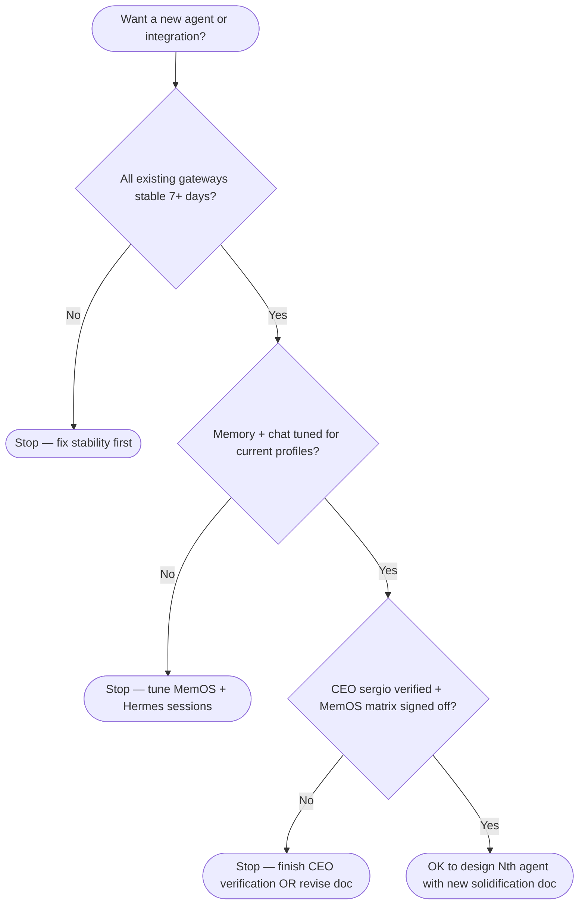
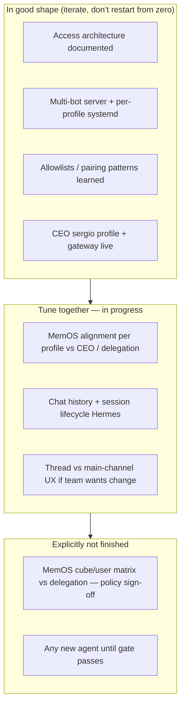

# Tower — Architecture solidification roadmap (plan in motion)

This document is a **living plan**, not a finished state. It complements the **target access model** in `docs/tower-agent-access-architecture.md` with a **phased flow**: what is done, what remains, and **when we stop adding agents** until the stack is solid.

**Principle:** **No new agents** until existing gateways, Discord policy, memory (MemOS), and chat/session behavior are **aligned and stable**.

---

## 1. One-page idea (what you are building)

You are **not** “collecting more bots.” You are **hardening one coherent system**:

1. **Freeze scope** — treat Mohamed, Arinze, **Krati (`krati`)**, Research, HR, and CEO **`sergio`** as the **current** surface (no further agent *types* until the stack is stable). **`krati`** added **2026-05-16** per operator request — see **`docs/tower-krati-agent-setup.md`**.
2. **Solidify** — same architecture doc, same allowlists, same `systemd` + `--profile` discipline, **no duplicate Telegram tokens** across concurrent `gateway run` processes (see `tower-agent-access-architecture.md` §7.2).
3. **Tune together** — MemOS `user_id` / `cube_id` per profile, Hermes **conversation placement** (§6.6 in `tower-agent-access-architecture.md`), session / chat history behavior, and Discord delivery (threads vs channel) so **memory + chat + agents** agree.
4. **Gate** — CEO **`sergio`** is **live**; remaining work is **verification** (Discord + MemOS policy) and **time-in-market** stability before adding integrations.
5. **Hold the line** — new agents or new integrations only after another explicit “solidification” cycle.

---

## 2. Master flow — phases (current → solid)

```mermaid
flowchart LR
  subgraph P0["Phase 0 — Today"]
    A0[Access doc written]
    A1[Mohamed / Arinze / Research / HR live]
    A2[CEO sergio live — verify + stabilize]
  end

  subgraph P1["Phase 1 — Solidify foundations"]
    B1[Verify every gateway unit has correct --profile]
    B2[Discord allowlists match architecture doc]
    B3[No shared Telegram token across gateways]
    B4[Intents + channel perms consistent per bot]
  end

  subgraph P2["Phase 2 — Tune memory + chat together"]
    C1[MemOS user_id / cube_id per profile vs policy]
    C2[Hermes session / chat history / compaction rules]
    C3[Discord home + threading behavior acceptable to team]
  end

  subgraph P3["Phase 3 — CEO sergio (shipped)"]
    D1[sergio profile + bot + systemd unit]
    D2[Allowlist CEO-only + docs aligned]
  end

  subgraph P4["Phase 4 — Freeze new agents"]
    E1[Regression pass all profiles]
    E2[Explicit approval to add Nth agent]
  end

  P0 --> P1 --> P2 --> P3 --> P4
```

**Reading left to right:** you move the whole platform along the arrow; you do **not** skip to “more agents” while P1 or P2 is red.

---

## 3. Decision gate — “Are we allowed to add another agent?”

This encodes your rule: **solid first, growth second.**

---

## 4. “What’s left” swimlane (work vs deferred)

---

## 5. Checklist (concrete exit criteria for “solid”)

Use this before declaring Phase 2 done or treating the stack as **merge-frozen** for new agents.

| # | Criterion |
|---|-----------|
| 1 | Every `hermes-gateway-*.service` shows **`active (running)`** without restart loops. |
| 2 | **`journalctl`** for each unit: no recurring **401 Discord**, **Telegram token in use**, or **4004 intents**. |
| 3 | **`DISCORD_ALLOWED_USERS`** (or pairing) matches `tower-agent-access-architecture.md`. |
| 4 | MemOS keys / `MEMOS_*` per profile match **who** should own which memory (**keys present ≠ policy verified** — still need human matrix sign-off). |
| 5 | Team agrees on **home channels** and whether **threads** are acceptable. |
| 6 | CEO **`sergio`:** **`hermes-gateway-sergio.service`** + CEO-only allowlist + Discord layout per **`tower-discord-channels-permissions.md`** — **live**; **Sergiusz** confirms behavior in Discord. |

---

## 6. Related documents

| Document | Role |
|----------|------|
| `docs/tower-architecture.md` | **Teammate on-ramp** — all architecture views, Discord/Hermes/MemOS, current vs target. |
| `docs/tower-agent-access-architecture.md` | Target **who talks to whom** + diagram + **Discord layout** + **implementation status** (§7). |
| `docs/hermes-tower-inventory.md` | Ops discovery runbook + link to architecture. |
| This file | **Phased plan**, gates, and “not finished yet” scope. |

---

## 7. Revision history

| Date | Change |
|------|--------|
| 2026-05-11 | Initial roadmap: phase flow, add-agent gate, swimlane, exit checklist. |
| 2026-05-12 | CEO naming + **`sergio` live**: §1 freeze-scope; P0/P3 diagram; gate Q3; swimlane (**D4**, deferred **X1** MemOS sign-off); checklist §5 row 6; checklist intro. |
| 2026-05-16 | **`krati`** personal agent added to scope; provision script + **`tower-krati-agent-setup.md`**. |
