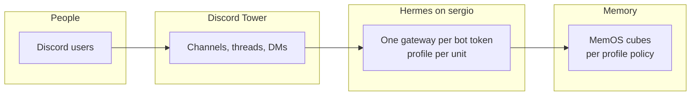
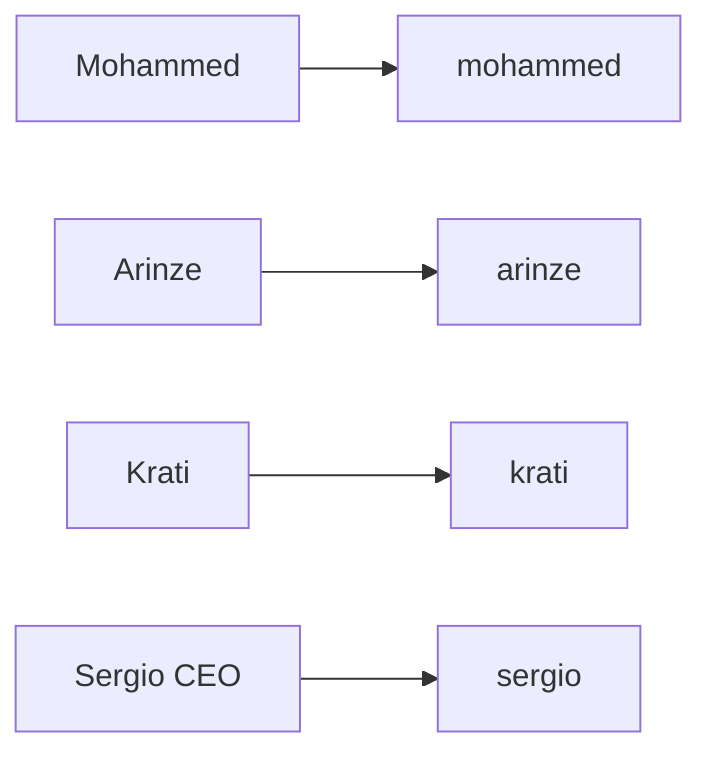
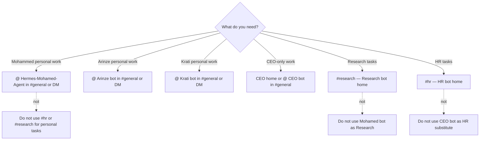
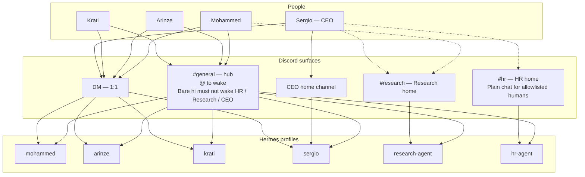
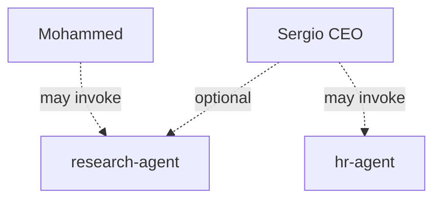
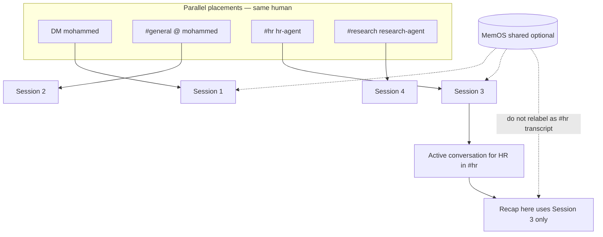
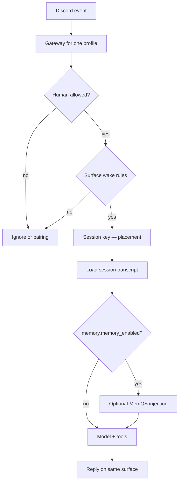

# Tower — Architecture (teammate guide)

This document is the **on-ramp** for anyone joining Tower work: what the system is, how the pieces fit, what is **live today** on **`sergio`**, and what we are **still hardening**. It pulls together the architecture views that are spread across the repo so you do not have to read four separate manuals to orient yourself.

**Host:** **`sergio`** (Tower). **Primary chat surface:** Discord. **Agent runtime:** Hermes (`~/.hermes`, one **profile** + one **gateway** per Discord bot). **Long-term memory (optional):** MemOS cubes per profile policy.

**Deep dives (authoritative detail):**

| Document | Use when you need… |
|----------|-------------------|
| [`tower-agent-access-architecture.md`](tower-agent-access-architecture.md) | People ↔ bots ↔ Discord ↔ MemOS, **L0–L7** diagrams, placement policy **§6.6**, Hermes **§8**, implementation status **§7** |
| [`tower-discord-channels-permissions.md`](tower-discord-channels-permissions.md) | Step-by-step Discord channel creation, **Deny View**, `/sethome`, Hermes `require_mention` / `free_response_channels` |
| [`tower-architecture-solidification-roadmap.md`](tower-architecture-solidification-roadmap.md) | Phased plan, **no new agents** gate, exit checklist |
| [`tower-krati-agent-setup.md`](tower-krati-agent-setup.md) | Provision **`krati`** profile + Discord bot on `sergio` |
| [`hermes-tower-inventory.md`](hermes-tower-inventory.md) | Ops runbook: skills, Docker, discovery commands on `sergio` |

Update this file when Tower scope, live profiles, or the “current vs target” table changes.

---

## 1. What Tower is (one page)

Tower is **not** “a pile of Discord bots.” It is one **coherent multi-agent system** on **`sergio`**:

1. **People** talk on **Discord** (channels, threads, DMs).
2. **Hermes gateways** (one per bot token) turn messages into model turns for **one profile** each.
3. **Hermes sessions** hold the **conversation in this room** (placement).
4. **MemOS** (when enabled) holds **optional long-term memory** per profile cube — **not** a copy of Discord scrollback.

**Live profiles on `sergio`:** personal **`mohammed`**, **`arinze`**, **`krati`**, CEO **`sergio`**, specialists **`research-agent`** and **`hr-agent`**. **`krati`** added **2026-05-16** (operator provision — see [`tower-krati-agent-setup.md`](tower-krati-agent-setup.md)). Further agent **types** still follow the [solidification gate](tower-architecture-solidification-roadmap.md#3-decision-gate--are-we-allowed-to-add-another-agent).

**Invariant:** one Discord application → one bot token → one long-running `gateway run` → one Hermes profile. Never run two gateways on the same token.

---

## 2. Architecture catalog (which diagram answers which question)

Read **top-down** when onboarding:

| Level / view | Question it answers | Where |
|--------------|---------------------|--------|
| **L0 — Tower stack** | What are the four layers from human to memory? | Below §3.1; full diagram in [access doc §4.1](tower-agent-access-architecture.md#41-level-0--tower-stack-one-glance) |
| **L1 — Primary agents** | Who owns which personal bot? | §3.2; [§4.2](tower-agent-access-architecture.md#42-level-1--primary-agents-11) |
| **L2 — Delegation** | Who may **also** invoke HR / Research? | §5; [§4.3](tower-agent-access-architecture.md#43-level-2--delegation-shared-specialists) |
| **L3 — Discord surfaces** | Which **room** for which kind of work? | §4; [§4.4](tower-agent-access-architecture.md#44-level-3--discord-surfaces-where-to-talk) |
| **L4 — Triggers** | When does a bot wake (`@`, home channel, DM)? | §4.3; [§4.5](tower-agent-access-architecture.md#45-level-4--triggers-how-a-bot-wakes) |
| **L5 — Context** | Session vs MemOS vs Discord scrollback? | §6; [§4.6](tower-agent-access-architecture.md#46-level-5--context-at-reply-time-do-not-confuse) |
| **L6 — End-to-end** | People, rooms, bots, context in one picture | [§4.7](tower-agent-access-architecture.md#47-level-6--end-to-end-integrated) |
| **L7 — Placement** | Same human, parallel conversations | §6; [§4.8](tower-agent-access-architecture.md#48-level-7--conversation-placement-active-vs-parallel) |
| **Two gates** | Discord **View Channel** vs Hermes **allowlist** | [§3.3](tower-agent-access-architecture.md#33-diagram--two-independent-gates-human--bot) |
| **Hermes on `sergio`** | Profile dirs, gateway path, tools | §7; [access §8](tower-agent-access-architecture.md#8-hermes-architecture-tower-on-sergio) |
| **Runtime units** | `systemd` unit ↔ profile ↔ token | [§9.7](tower-agent-access-architecture.md#97-diagram--runtime-on-sergio-profiles--gateways) |
| **Phasing** | What is done vs tuning vs deferred | §8; [roadmap](tower-architecture-solidification-roadmap.md) |

---

## 3. Stack and ownership

### 3.1 Level 0 — Tower stack

### 3.2 Level 1 — Primary agents (1:1)

Each teammate’s **default** Hermes profile on Discord. **`DISCORD_ALLOWED_USERS`** should match this unless policy deliberately widens access.

| Person | Hermes profile | Discord bot (example name) | Primary purpose |
|--------|----------------|------------------------------|-----------------|
| Mohammed | `mohammed` | Hermes-Mohamed-Agent | Mohammed’s personal agent |
| Arinze | `arinze` | Hermes-Arinze (or equivalent) | Arinze’s personal agent |
| Krati | `krati` | Hermes-Krati-Agent (example) | Krati’s personal agent |
| Sergio (CEO) | `sergio` | CEO agent | CEO-only work |

### 3.3 Specialist profiles (shared, not personal substitutes)

| Profile | Bot role | Not a substitute for |
|---------|----------|----------------------|
| `research-agent` | Research / deep-dive | Personal agents |
| `hr-agent` | HR specialist | CEO or personal agents |

---

## 4. Discord architecture (for teammates)

Discord is the **coordination layer**: who **sees** which room, how you **wake** a bot, and where **sessions** attach. Two independent controls apply to every message:

1. **Discord permissions** — can this human or bot **see** the channel?
2. **Hermes allowlist** — may this human **invoke** this profile (`DISCORD_ALLOWED_USERS` or pairing)?

A human can pass one gate and fail the other. Both must match intent.

### 4.1 Channel map (target layout)

| Surface | Typical humans | Bots that should **see** it (among Hermes agents) | How you use it |
|---------|----------------|---------------------------------------------------|----------------|
| **`#general`** (hub / THE SPIRE) | Team + all invited bots | **All** invited Hermes bots | Shared room; **@ the bot you want**. Specialists and CEO do **not** answer bare `hi` here. |
| **`#hr`** | CEO + ops you add | **`hr-agent` only** | HR work; **plain chat** (no `@` HR) for allowlisted humans. Other agent bots **Deny View**. |
| **`#research`** | Mohammed + CEO + others you add | **`research-agent` only** | Research work; **plain chat** in home channel. Other bots **Deny View**. |
| **CEO home channel** | Sergio | **CEO (`sergio`)** only | CEO personal agent home; **plain chat** with CEO bot. Not `#hr` / `#research`. |
| **DM with a bot** | Owner on that bot’s allowlist | **That bot only** | 1:1 with your personal agent (or a bot that DMs you). |

**Clean-room pattern for `#hr` / `#research`:** every **other** agent bot role gets **View Channel → Deny** on that channel so the wrong bot cannot read or hijack replies. Humans get **View** only if policy says they should use that room. Procedure: [`tower-discord-channels-permissions.md`](tower-discord-channels-permissions.md).

### 4.2 Routing by intent (which room, which bot)

### 4.3 Triggers — how a bot wakes

| Bot class | `#general` | Home (`#hr`, `#research`, CEO home) | DM |
|-----------|------------|-------------------------------------|-----|
| **Personal** (`mohammed`, `arinze`, `krati`) | **`@` required** (**no auto-thread** in THE SPIRE `#general` via `no_thread_channels`) | N/A unless you add a private personal channel later | **Every message** (no `@`) |
| **Specialists + CEO** | **`@` required** | **Plain messages** OK when channel id is in **`free_response_channels`** | Per bot policy / allowlist |
| **All in `#general`** | Bare **`hi`** must **not** wake HR / Research / CEO | — | — |

**Hermes keys (on `sergio`, per profile):** `discord.require_mention`, `discord.free_response_channels`, `DISCORD_HOME_CHANNEL`, `discord.auto_thread`, `discord.no_thread_channels`. After edits: restart the matching `hermes-gateway-<suffix>.service`.

**Threads:** a **new thread** after an `@` in `#general` is often a **new Hermes session** unless you **continue in the same thread**. Mohamed’s THE SPIRE `#general` is tuned so `@` replies can **stay in the parent channel** and stack in one per-user session.

### 4.4 Discord + Hermes home alignment

For specialist **ambient** home channels, these must point at the **same numeric channel id** for that profile:

- `DISCORD_HOME_CHANNEL` in `~/.hermes/profiles/<profile>/.env`
- `discord.free_response_channels` in `config.yaml`
- `/sethome` in Discord (optional but should agree)
- `channel_directory.json` entries for that guild

If HR home accidentally points at `#research`, plain messages in `#hr` look “dead” while the wrong channel still works. Fix on `sergio`, then restart the gateway unit.

### 4.5 End-to-end Discord view (integrated)

---

## 5. Access and delegation

### 5.1 Primary access (who talks to which bot)

| Agent profile | Who should talk to this bot on Discord |
|---------------|----------------------------------------|
| `mohammed` | Mohammed (primary) |
| `arinze` | Arinze (primary) |
| `krati` | Krati (primary) |
| `sergio` | Sergio / CEO (primary) |
| `research-agent` | Mohammed + anyone else policy adds (e.g. CEO) |
| `hr-agent` | Sergiusz + anyone else policy adds |

Numeric **Discord user IDs** live in `~/.hermes/profiles/<profile>/.env` as `DISCORD_ALLOWED_USERS`. **Do not commit real IDs** into this repo.

### 5.2 Delegation (shared specialists)

Delegation is **policy**, not automatic routing from personal bots. Add the delegator’s Discord id to the **specialist** profile’s allowlist.

| Person | May invoke (in addition to primary agent) |
|--------|-------------------------------------------|
| Mohammed | **Research** agent |
| Sergio (CEO) | **HR** agent (and optionally **Research**) |
| Arinze | *(none by default)* |
| Krati | *(none by default)* |

### 5.3 MemOS vs Discord allowlist

- **Discord allowlist** controls **who can talk to which bot**.
- **`MEMOS_USER_ID` / `MEMOS_CUBE_ID`** control **whose memory** is read and written for that profile.

Those layers are **independent**. Delegation on Discord does **not** automatically grant cross-cube MemOS reads. Keys can be **present** on `sergio` while **policy sign-off** is still outstanding.

---

## 6. Context, sessions, and conversation placement

### 6.1 Three sources teammates confuse

| Source | What it is | What it is **not** |
|--------|------------|---------------------|
| **Hermes session transcript** | This profile’s turns in **this** thread, DM, or per-user channel session | Full `#general` scrollback; other people’s messages; another bot’s room |
| **MemOS / memory tools** | Long-term stored facts per profile cube policy | A guaranteed “last N Discord lines” export |
| **Discord channel history** | What humans see in the client | Not automatically loaded into the model on every reply |

### 6.2 Placement (active conversation)

**Placement** = **this Hermes profile** + **this Discord surface** (channel / thread / DM) + **this Discord user**. That tuple selects **one active Hermes session**.

The same human may run **parallel** placements (e.g. Mohamed **DM** + `#hr` with HR + `@` Mohamed in `#general`). They must **not** be merged in answers unless the user **quotes** or explicitly asks for **stored** cross-placement facts.

**Rules for every bot:**

1. Default answers come from the **active conversation** (this placement’s session).
2. Recap / “what did **you** say **here**” requests use **only** this session — not `memory_search` / `session_search` unless the user explicitly asks for **stored** memory.
3. MemOS injection is **shared store**, not “messages in this channel.”
4. Personal agents own **personal** placements; specialists own **specialist** placements.

Full policy, placement map, and regression prompt: [access doc §6.6](tower-agent-access-architecture.md#66-conversation-placement-and-identity-tower-policy).

### 6.3 Apply placement policy on `sergio`

1. On **`sergio` (SSH)**, from a copy of this repo: run `bash scripts/tower-apply-conversation-policy.sh` (LF line endings).
2. Confirm gateways: `systemctl --user is-active hermes-gateway-hr-agent.service` (and units the script restarts).
3. **On Discord** in `#hr`, run the §6.6 regression prompt from the access doc as an allowlisted user.

Optional strict HR (disables MemOS injection on `hr-agent`): `scripts/tower-hr-strict-placement-enforce.sh`.

---

## 7. Hermes runtime on `sergio`

| Piece | On Tower |
|-------|----------|
| **Host** | `sergio` — install under `~/.hermes`; operator user `openclaw` |
| **Profile** | `~/.hermes/profiles/<profile>/` — `config.yaml`, `.env`, `SOUL.md`, `channel_directory.json` |
| **Gateway** | `gateway run --profile <name>` per Discord token; `hermes-gateway-<suffix>.service` (user **systemd**) |
| **Surfaces** | Discord primary; some profiles also define Telegram (**no duplicate tokens** across concurrent gateways) |

**Inbound path (simplified):**

**Session key inputs:** profile, channel/thread/DM, `group_sessions_per_user`, `no_thread_channels`, home / `auto_thread` settings — see [access §8.4](tower-agent-access-architecture.md#84-sessions-and-placement).

---

## 8. What is on Tower today vs what we should have

Living detail lives in [access doc §7](tower-agent-access-architecture.md#7-implementation-status-living). Summary for teammates:

### 8.1 In good shape (iterate, do not restart from zero)

- Access model documented: primary vs delegated use of all six profiles (including **`krati`**).
- Multi-bot Discord server with **per-profile systemd** units.
- **`#hr`** clean room: wrong-agent bots denied **View**; HR home + ambient chat aligned after id fixes.
- **`#research`** same pattern; Research gateway active on `sergio`.
- **`#general` mention-only** for specialists + CEO; personal agents unchanged where documented.
- CEO **`sergio`**: dedicated unit + CEO-only allowlist; home channel + `@` in `#general`.
- Conversation placement **scripts** and SOUL markers available (`tower-apply-conversation-policy.sh`).

### 8.2 Partial / known gaps

- **`sergio` + `mohammed` Telegram:** same `TELEGRAM_BOT_TOKEN` → “token already in use” in logs until `sergio` gets a **dedicated** BotFather bot or Telegram is removed from one profile.
- **`hr-agent`:** Discord-first (Telegram token removed from HR profile to avoid competing with `mohammed`).
- **MemOS:** `MEMOS_*` **set** on profiles on `sergio` (run audit after adding **`krati`**); **human sign-off** still required that cube ownership matches delegation policy.
- **HR recap regression:** placement SOUL applied; **#hr-only** assistant recap can still **fail** when MemOS injection is treated as channel transcript — see §7.3 in access doc.

### 8.3 Explicitly deferred (until solidification gate)

- New agent **types** beyond the current roster ( **`krati`** provisioned **2026-05-16** ) before stability checklist passes — [roadmap §3](tower-architecture-solidification-roadmap.md#3-decision-gate--are-we-allowed-to-add-another-agent).
- **`krati`:** gateway **pending** until `DISCORD_BOT_TOKEN` + `DISCORD_ALLOWED_USERS` on `sergio` — [`tower-krati-agent-setup.md`](tower-krati-agent-setup.md).
- Optional dedicated per-person channels (general hub remains shared for now).
- Product-level MemOS scoping on recap (gateway / MemOS to-do in access §7.3).

### 8.4 Infrastructure on `sergio` (inventory snapshot)

Hermes profiles under `~/.hermes/profiles/` include at least: `mohammed`, `arinze`, `krati`, `sergio`, `hr-agent`, `research-agent`. Docker and supporting services (Firecrawl, SearXNG, Postgres, Playwright, vector/graph stores, etc.) are documented in the [inventory guide](hermes-tower-inventory.md) — run discovery there before assuming a skill or integration exists.

---

## 9. Operator scripts (repo)

| Script | Purpose |
|--------|---------|
| `scripts/tower-apply-conversation-policy.sh` | Bundle: session context, MemOS boundary SOUL, HR/recall fixes; restarts gateways |
| `scripts/tower-discord-session-context.sh` | Session scope + Mohamed `no_thread_channels` for THE SPIRE `#general` |
| `scripts/tower-memos-agent-boundary.sh` | SOUL: MemOS ≠ this session |
| `scripts/tower-hr-channel-recall-fix.sh` | Specialist recap + `user_profile_enabled: false` on specialists |
| `scripts/tower-hr-strict-placement-enforce.sh` | Optional: strict HR without MemOS injection |
| `scripts/tower-audit-memos-telegram.sh` | Audit `MEMOS_*` / Telegram token presence on `sergio` |
| `scripts/sergio-discord-require-mention-general.sh` | `#general` mention-only tuning for specialists + CEO |
| `scripts/tower-provision-krati-agent.sh` | Create **`krati`** profile + systemd unit + hub Discord tuning on `sergio` |
| `scripts/tower-provision-krati-memos.sh` | MemOS user **`krati`**, cube **`krati-cube`**, API key + `.env` |

Run on **`sergio`** via SSH; do not commit secrets from profile `.env` files into this repo.

---

## 10. Teammate quick start

### 10.1 If you only use Discord (Mohammed, Arinze, Krati, Sergio)

1. **Personal work:** `@` your bot in **`#general`** or use **DM** with your bot (no `@` in DM).
2. **Research (if allowlisted):** use **`#research`** — not your personal bot as Research.
3. **HR (if allowlisted):** use **`#hr`** — not CEO or personal bots as HR.
4. **CEO-only work (Sergio):** **CEO home** or `@` CEO bot in **`#general`**.
5. In **`#general`**, do not expect HR / Research / CEO to reply to bare `hi` — **`@` the bot you want**.
6. For “what did you say **in this room**,” ask in **that room**; do not expect the bot to know full channel scrollback or another bot’s DM.

### 10.2 If you operate on `sergio`

1. Read [access architecture](tower-agent-access-architecture.md) §7 before changing allowlists or channels.
2. After `.env` or `config.yaml` edits, restart the matching `hermes-gateway-*.service`.
3. Use `journalctl --user -u hermes-gateway-<unit>.service` for failures (401, intents, Telegram token in use).
4. Before adding a bot or integration, walk the [add-agent gate](tower-architecture-solidification-roadmap.md#3-decision-gate--are-we-allowed-to-add-another-agent).

### 10.3 Verify you understand the layout

1. In **`#general`**, send bare `hi` — HR / Research / CEO should **not** wake.
2. In **`#hr`** (if you have access), send plain text without `@` — only **HR** should answer among agents.
3. Ask your personal bot in **DM** a follow-up without `@` — it should continue the DM session.
4. In **`#hr`**, run the placement regression prompt from [§6.6](tower-agent-access-architecture.md#66-conversation-placement-and-identity-tower-policy) if you are validating ops changes.

---

## 11. Revision history

| Date | Change |
|------|--------|
| 2026-05-14 | Initial teammate guide: architecture catalog, Discord/Hermes/MemOS views, current vs target, script index, quick start. |
| 2026-05-16 | Added **`krati`** personal agent; CEO naming **Sergio**; [`tower-krati-agent-setup.md`](tower-krati-agent-setup.md). |
